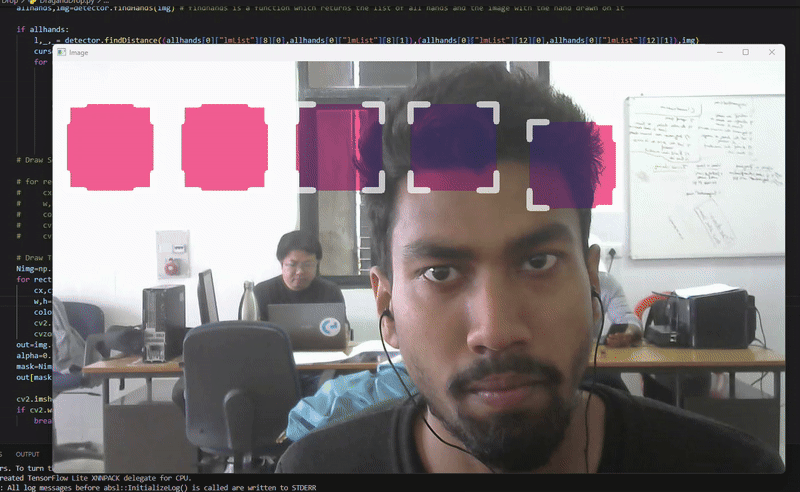

# 🧲 Drag and Drop Floating Box – Seamless UI Interaction

Ever wanted a more dynamic and flexible user interface? The Drag and Drop Floating Box makes your screen elements moveable and interactive. This project introduces a floating box that you can click and drag around your interface, enhancing user engagement and design freedom in both desktop and web apps.

## 🚀 Features

✅ **Interactive Dragging** – Click and drag the box anywhere on the screen.  
✅ **Smooth & Responsive** – Real-time position updates for seamless UX.  
✅ **Lightweight & Customizable** – Easily adjust size, color, or behavior.  
✅ **Cross-Platform Compatible** – Works with major desktop or web UI frameworks.

## 🔧 Installation

Make sure Python is installed, then install dependencies:

```pip install -r requirements.txt```


## ▶️ Running the Program

To launch the floating box app, run:

```python DragandDrop.py```

## 📸 Demonstration

Here’s a quick look at the Drag and Drop Floating Box in action:

