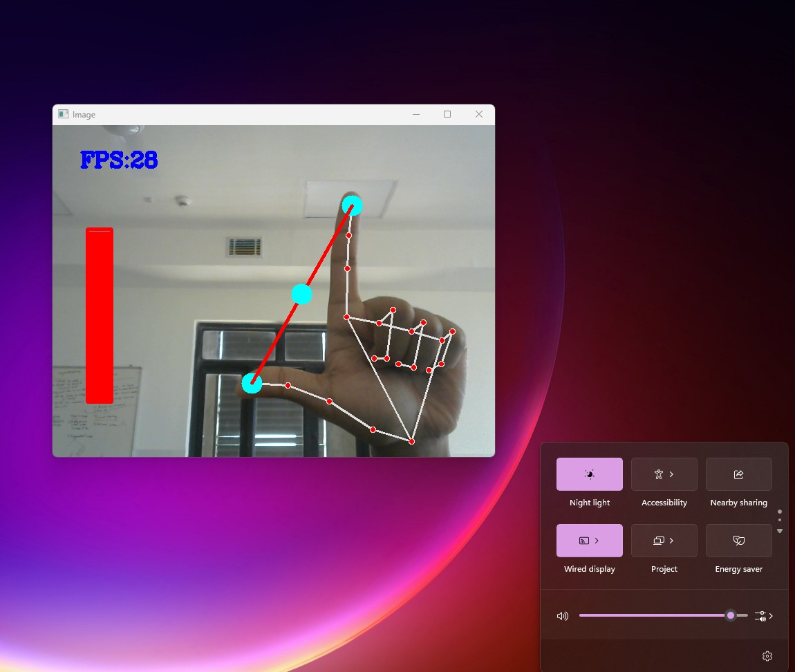

# 🎛 Control Windows Volume with Hand Gestures ✋👌

This project allows you to control the system volume on Windows using hand gestures, providing a seamless and intuitive experience.

### 🔧 Installation

Before running the program, install all required dependencies:

```pip install -r requirements.txt```

### ▶️ Running the Program

Once the installation is complete, execute the Python script(VolumeControl.py) to start controlling the volume with hand gestures.

### 📸 Demonstration

Below is an image demonstrating the functionality of this project:


